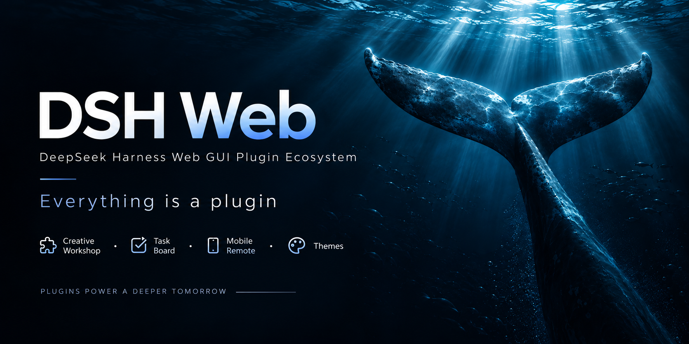

# dsh-web · Modular Plugin Ecosystem & Themes for DeepSeek Harness (DSH) Web GUI

[中文](README.md) | English

dsh-web is an all-in-one modular plugin ecosystem and AI agent workbench for DeepSeek Harness (DSH) Web GUI and the official desktop client. It equips developers and power users with autonomous task automation boards (cron scheduling), mobile and cross-device remote control, SSH terminal operations and cluster management, visual Git commit graphs with multi-agent worktree isolation, full session archive management, token usage and cost monitoring, and a unified workshop for themes, skins, and desktop pets. Users can install the complete plugin bundle into an existing `dsh web` instance via the official profile mechanism, or install and run it directly in the official DeepSeek Harness desktop client.

<p align="center">
  
</p>

<p align="center">
  
  &nbsp;
  
  &nbsp;
  
  &nbsp;
  <a href="https://www.npmjs.com/package/@linxin666/dsh-web-all"></a>
  &nbsp;
  <a href="https://www.npmjs.com/package/@linxin666/dsh-web-all"></a>
  &nbsp;
  <a href="https://dshfind.com/zh/plugins/zhu1090093659/dsh-web?ref=badge"></a>
  &nbsp;
  <a href="https://dsh-market.com"></a>
  &nbsp;
  <a href="https://www.npmjs.com/package/@deepseek-ai/dsh"></a>
  &nbsp;
  
</p>

<p align="center">
  <strong>DeepSeek Harness (DSH) Web Plugin Ecosystem · Modular Agent Workspace</strong><br>
  <em>Workshop · Task Board · Mobile Remote · SSH Ops · Git Graph · Usage Statistics · Session Archive</em>
</p>

<div align="center">

[What It Is](#what-it-is) · [Official Desktop Client](#official-desktop-client) · [Workshop](#workshop-dsh-marketcom) · [Feature Plugins](#feature-plugins) · [Skins](#skins) · [Quick Start](#quick-start) · [Compatibility](#compatibility-and-environments) · [FAQ](#faq) · [Known Limitations](#known-limitations) · [Community](#community) · [Business Cooperation](#business-cooperation)

</div>

## What It Is

Stock DeepSeek Harness Web delivers fundamental chat interactions and tool execution capabilities. However, production workflows often require concurrent task scheduling, persistent background runs, remote collaboration, and developer-oriented tooling.

dsh-web mounts directly into `dsh web` via official profiles without modifying DSH core source code, providing a comprehensive modular extension suite:
- **Developer Operations & Collaboration Plugins**: Long-running scheduled task boards, cross-device mobile remote control, SSH terminal operations and file transfers, Git history graphs with worktree isolation, full session archive management, and model capability declarations;
- **Decoupled Visual Themes & Assets**: Functional plugins and visual assets remain strictly separated. The skin loader handles stylesheet and dynamic effect rendering, while themes and animated desktop pets can be installed on demand from the [DSH Workshop](#workshop-dsh-marketcom);
- **Bundled or Pick-and-Choose**: Install everything with one command via `@linxin666/dsh-web-all`, or install individual plugins independently. The aggregate pre-integrates every family plugin - see the [plugin bundle installation and configuration guide](packages/dsh-web-all/README.md).


| Core Capability | Stock dsh web | dsh-web Modular Ecosystem Advantage |
| --- | --- | --- |
| Agent Presets | Stock presets only (Standard / Minimal, etc.) | Stock presets + instant activation of community presets from Workshop |
| Custom Model Capabilities | No visual configuration for model attributes | Visual declarations for vision image inputs and reasoning effort tiers |
| Autonomous Task Board | None | 5-column lifecycle board + real agent execution + cron-scheduled background runs |
| Mobile & Remote Control | Localhost browser only | QR code pairing, cross-device PC access, SSE token streaming & touch gestures |
| Remote Server Operations | None | Web-based SSH terminal (xterm.js), SFTP file transfer, tunnels & cluster commands |
| Token Usage & Cost Monitor | None | Daily token metrics, provider balance queries, plan quota tracking & Token Bank |
| Git Visualization & Worktrees | Command line only | Visual branch & commit graph + automated Git worktree directory isolation |
| Session Lifecycle & Archive | Basic session list | Full-text & faceted search, batch archiving, cascade deletion & retention rules |
| Themes & Visual Skins | Default theme only | Bundled Blue Fantasy dark theme + marketplace for skins, pets & live wallpapers |

### Quick Index by Use Case

| User Goal & Scenario | Recommended Solution & Capability | Entry Point |
| --- | --- | --- |
| Run autonomous unattended AI tasks, daily code audits, health checks, or automated reports | Task Board: 5-column tracking, cron scheduling, power management, session reuse | [Task board and cron execution](packages/dsh-task-board/README.md) |
| Access DeepSeek from an iPhone, Android device, iPad, or another remote computer | Mobile Remote: instant QR pairing, SSE real-time streaming, touch gestures & security gate | [Mobile and PC browser remote control](packages/dsh-remote-web-ui/README.md) |
| Perform Linux server administration, SFTP configuration sync, or remote troubleshooting | SSH Remote Ops: web terminal, visual SFTP, port forwarding tunnels, cluster commands | [SSH terminal, file transfer, and tunnels](packages/dsh-ssh/README.md) |
| Monitor multi-provider token consumption, check API balances, or track subscription quotas | Usage Statistics: daily token breakdown, balance queries, bill estimation & Token Bank | [Usage statistics and Token Bank](packages/dsh-usage/README.md) |
| Prevent Git merge conflicts and dirty working trees during multi-agent concurrent coding | Git Graph & Worktree: visual commit swimlanes, automated session worktree branches | [Git visualization and worktree isolation](packages/dsh-git-graph/README.md) |
| Clean up and manage large numbers of historical sessions without losing valuable context | Session Archive Manager: faceted filtering, batch archive/delete, automated retention | [Full session archive management](packages/dsh-session-archive/README.md) |
| Declare multimodal vision support or adjust reasoning effort tiers for custom models | Model Capabilities: per-model visual vision declaration and reasoning effort profiles | [Model capabilities declarations](packages/dsh-model-capabilities/README.md) |
| Customize the interface with dark mode, immersive aesthetic skins, dynamic backgrounds, or pets | Workshop & Skin Center: built-in Blue Fantasy theme + rich marketplace catalog | [Explore the DSH Workshop](https://dsh-market.com) |
| Run plugins directly inside the official DeepSeek Harness Desktop application | Official Desktop Client: install the bundle directly via in-app plugin settings | [Official desktop client guide](#official-desktop-client) |
| Add the modular extension suite to an existing DeepSeek Harness CLI setup | Quick Start: one-command installation via npm or GitHub repository URL | [Quick start installation](#quick-start) |

## Official Desktop Client

For a dedicated desktop application experience, we recommend downloading and using the official DeepSeek Harness desktop client (DeepSeek Harness Desktop).

The official desktop client shares the `~/.dsh` data directory with `dsh web` and operates under its internal `desktop` profile. Because the official desktop client manages the `desktop` profile exclusively within the application (external CLI commands reject modifications to the `desktop` profile), install this plugin bundle directly from inside the desktop client:

1. Open the official desktop client and navigate to the **Plugins** section in **Settings** (or the sidebar plugins view);
2. In the plugin installation input field, enter the aggregate package specifier `@linxin666/dsh-web-all` (or `@linxin666/dsh-web-all@latest`), then click **Install**;
3. Restart the desktop client once installation completes to activate all family plugins, including the task board, themes, and remote access.

## Workshop (dsh-market.com)

The [DSH Workshop](https://dsh-market.com) is a unified hub for themes, pets, plugins, and community Agent presets. Entries are ranked by verified device likes; themes provide live interactive previews, and plugins offer copy-ready install commands. The classic Blue Fantasy theme is bundled with the skin center plugin; additional themes and pets can be previewed, inspected, and installed on demand. In the Web GUI, the "Workshop" settings tab lets you browse the catalog directly: skins and pets install straight into the DSH home directory for immediate use, while community presets install to an inactive local library and activate under "Settings → Agent Presets".


The site is built directly from this repository: static pages are generated by `scripts/market-build` from authoritative manifests (`skin.json`, `pet.json`, and `community.json`), while interactive features like anonymous voting run on Cloudflare Workers edge functions with D1 persistence (one vote per device). Changes deploy automatically on push to `main`.

The Workshop provides an open, transparent space for community creators to share their work and for users to discover vetted extensions.

## Feature Plugins

### Task Board（Task Board · Autonomous AI Agent Tasks & Cron Scheduling）

Open from the "Task Board" icon in the sidebar. Tasks are organized into five columns: Backlog, Todo, In Progress, Done, and Failed. Clicking "Run" on any card dispatches the task to an autonomous DSH agent session; status updates automatically write back to the card upon completion, and you can jump straight into the execution session to review the conversation log.

Tasks also support persistent host scheduling: configure cron expressions in task details (such as running daily upgrades at 23:00 or generating weekly reports on Mondays at 09:00). Scheduled tasks execute reliably even when browser tabs are closed. An optional power-management setting prevents system idle sleep while allowing screens to power down on macOS, Windows, and Linux with systemd-logind (disabled by default).

Tasks can optionally reuse sessions: when enabled, subsequent runs continue in the previous session if it remains idle in memory (retaining conversation context while re-applying designated permissions and models); if the session has exited, a fresh session is spawned automatically.

| Multi-Column Board | Scheduled Execution |
| --- | --- |
|  |  |

### Mobile Remote Control（Mobile Remote · Mobile Access & Cross-Device Touch Optimization）

Click the phone icon at the bottom of the sidebar to open the pairing modal. Scan the QR code or copy the link to access the full Web GUI on your mobile browser with dedicated touch adaptations: tap the whale floating button to toggle the sidebar, swipe horizontally to show or hide panels, long-press session items for context menus, press Enter for newlines, and interact with 16px inputs configured to prevent viewport auto-zooming. Desktop-heavy panels (such as SSH terminals, task boards, and Git graphs) automatically collapse on mobile screens, leaving a focused interface for message exchange, model switching, and reasoning adjustments in sync with the desktop state.

The same pairing link works seamlessly on **secondary PC browsers**: open the desktop URL variant on another computer to launch the full Web GUI interface. All traffic passes through the authenticated `/remote/api` proxy route; unpaired devices encounter an access-denied banner. Pairing tokens are single-use and time-limited, and clicking "Stop" immediately revokes active device sessions. Communication defaults to the local network; pairing over wide-area networks is easily enabled using tunnel utilities like cloudflared. For security, route connections through the pairing gateway and avoid setting `--trusted-host` on tunnel domains, as that flag bypasses pairing checks (see [remote plugin README](packages/dsh-remote-web-ui/README.md)).


> **Real-Time Streaming & Tunnels**: Mobile clients rely on SSE (Server-Sent Events) for token streaming. Services like Cloudflare quick tunnels (trycloudflare.com) and Tailscale Serve do not proxy SSE streams by default; under these connections, the plugin automatically falls back to short polling. Messages send and receive normally with a minor polling interval delay. For smooth real-time streaming, use tunnels supporting persistent HTTP connections (such as Cloudflare named tunnels or self-hosted TCP proxies).

| Mobile Home (Whale toggle) | Session List |
| --- | --- |
|  |  |
| Chat (Thinking & Tool execution) | Model Selection Sheet |
|  |  |

### SSH Remote Ops（SSH Remote Ops · Web Terminal, SFTP Transfer & Cluster Commands）

Open the remote operations panel from the "SSH" sidebar icon. Supports key-based and password authentication, and imports existing host definitions from `~/.ssh/config` with one click; configurations persist securely in `~/.dsh/dsh-ssh.json`. Available capabilities include:

- **Web Terminal**: Full-featured interactive terminal powered by xterm.js with real-time output and responsive window resizing;
- **File Transfer**: Built-in SFTP file manager with visual upload and download progress bars and directory browsing;
- **Port Forwarding**: Local tunnels routing to remote internal services (such as databases or internal APIs), binding exclusively to 127.0.0.1;
- **Cluster Execution**: Concurrently dispatch commands across multiple servers filtered by alias, environment, or tags;
- **Agent Integration**: AI agents share host configurations with the panel; simply instruct the agent in chat to inspect remote servers and run diagnostics.

### Usage Statistics（Usage Statistics · Token Metrics, Balance Monitoring & Token Bank）

Monitor token consumption, provider balances, and subscription quotas under "Settings > Usage Statistics" with automated refresh and manual query options.

- **Usage Breakdown**: Track daily input, output, and cache token metrics segmented by provider and model, alongside 30-day expenditure trends; compatible providers display real-time balances, and DeepSeek official routes estimate off-peak pricing and billing details.
- **Subscription Tracking**: Monitor percentage allowances and reset schedules for personal plans including Kimi, GLM, MiniMax, OpenCode Go, and Codex / ChatGPT.
- **Token Bank**: Automatically mint 1 Whale Yuan for every token processed via DeepSeek official routes, tracked as collectible Whale Vouchers with sharing capabilities.
- **Pet Integration**: With the desktop pet plugin installed, floating desktop companions provide conversational bubble notifications displaying current quota balances and daily consumption.

Tracking starts upon initial plugin activation without backfilling historical sessions; vouchers cover DeepSeek official usage within configured ledger retention windows. See [dsh-usage README](packages/dsh-usage/README.md) for supported providers and limitations.


### Model Capabilities（Model Capabilities · Multimodal Vision & Reasoning Effort Profiles）

Configure model-level parameters for custom providers directly within "Settings > Models". This plugin supplies a visual editor for capabilities omitted from default cards:

- **Image Input Declarations**: Expand "Model Capabilities" within custom provider cards to explicitly declare multimodal support (`["text","image"]` or `["text"]`);
- **Reasoning Effort Profiles**: Mark non-reasoning models (hiding thinking sliders in the chat composer), inherit global defaults, or define explicit reasoning tiers with exact payload values;
- **Immediate Effect & Conflict Protection**: Changes save through official storage pathways and apply immediately without restarting the host; writes enforce revision checks to prevent overwriting concurrent updates;
- **One-Click Provider Toggling**: Temporarily disable provider routes without losing stored API keys, instantly hiding inactive models from selection pickers.

*Note: Declarations inform outgoing request payloads and do not perform automated gateway probing. If a model is declared with image support but the upstream provider gateway rejects multimodal payloads, the request will fail at the gateway level. Details in [dsh-model-capabilities README](packages/dsh-model-capabilities/README.md).*

### Git Graph（Git Graph · Visual Commits & Worktree Session Isolation）

An integrated Git toolbar and visual commit history graph positioned above the chat composer:

- **Branch & Commit Graph**: Visualizes branch forks, merge swimlanes, and commit timelines to help developers track changes and switch branches across projects.
- **Git Worktree Isolation**: When multiple agents run concurrent tasks, modifying files in the primary checkout risks branch collisions and dirty working trees. The plugin creates isolated worktrees under `$DSH_HOME/worktrees/` on dedicated branches (`wt/<name>`), leaving primary repository files untouched. An integrated management view lets developers inspect and prune temporary checkouts.
- **Automated Policies & Agent Tooling**: Enable automatic worktree allocation for new sessions entering Git workspaces, or provide the `git_worktree` tool to autonomous agents for self-directed environment management.

| Git Graph | Parallel Sessions with Git Worktree |
| --- | --- |
|  |  |

### Session Archive Manager（Session Archive · Full-Text Search, Batch Archiving & Lifecycle）

The session archive manager (`dsh-session-archive`) provides centralized governance over growing numbers of short-lived and persistent conversation logs:

- **Centralized Search & Filtering**: Audit active, archived, blank, subagent, and orphaned historical sessions with keyword filtering across titles, workspaces, and session IDs.
- **Batch Actions with Cascade Safety**: Perform multi-select archiving, restoration, and permanent deletions. Physical deletions display affected descendant counts and estimated reclaimed disk space, requiring confirmation prompts for bulk actions; active sessions and sessions with running children remain protected against deletion.
- **Automated Retention Policies**: Two optional automated rules archive stale sessions based on last activity and prune aged archives by retention period, with dry-run previews supported before enabling.

Permanent deletions cannot be undone, and all operational routes bind strictly to the local loopback interface. See [dsh-session-archive README](packages/dsh-session-archive/README.md).

### More Plugins（更多插件）

- **Skill Explorer** (`dsh-client-ui-skill-explorer`): Inspect and manage loaded agent skills grouped by origin, featuring keyword filtering across names and descriptions, workspace scoping, and activation toggling.
- **Plugin Manager** (`dsh-client-ui-plugin-manager`): Install plugins from npm or git repositories via official host interfaces, inspect statuses, and adjust configuration settings.
- **External archive manager** (external plugin [@mlgbnb/dsh-archive-manager](https://github.com/z953218350/dsh-archive-manager)): not installed. Its build imports the removed `@deepseek-ai/dsh-client-runtime` face; session archiving is provided by the built-in Session Archive Manager above.

### Skins

The classic Blue Fantasy theme serves as the built-in default skin: rich indigo gradients, semi-transparent frosted glass elements, and custom whale artwork provide an immersive dark-mode visual experience. Additional themes and Wallpaper Engine animated backgrounds are managed by the skin center and can be previewed, tried on, and installed through the [Workshop](https://dsh-market.com).


## Quick Start

### System Requirements

- DeepSeek Harness installed with `dsh web` functioning properly.
- npm installations have no extra requirements; building from the source repository requires Node.js >= 22 and pnpm.

### Get Started in 3 Steps (npm, Recommended)

- **DSH Web CLI (Browser Installation)**:
  1. Install the bundle: `dsh plugin --profile web add @linxin666/dsh-web-all@latest`
  2. Restart `dsh web` to display new plugin icons in the sidebar
  3. Navigate to "Settings > Plugin Configuration" to toggle individual features, or select skins from the skin panel
- **Official Desktop Client (DeepSeek Harness Desktop)**:
  1. Open the official desktop client and navigate to "Settings > Plugins"
  2. Enter `@linxin666/dsh-web-all` in the plugin install input and click Install
  3. Restart the client to access all plugin features and settings from the sidebar

> To install only the skin engine, use `@linxin666/dsh-client-ui-skin-center`. If your package manager pins an older version due to release age restrictions, see "Install Troubleshooting" below.

### Install Directly from the GitHub Repository

The repository root includes a standard `dsh.bundle` manifest, allowing installation directly from git without cloning or manual building:

```sh
dsh plugin --profile web add github:zhu1090093659/dsh-web
# Equivalent: dsh plugin --profile web add git+https://github.com/zhu1090093659/dsh-web.git
```

This approach is equivalent to installing the npm aggregate package. Use either method, but do not install both simultaneously to prevent conflicting entry IDs.

### Install from the Repository (Development)

For plugin development and debugging, build from source using Node.js >= 22 and pnpm:

```sh
# 1. Clone the repository
git clone https://github.com/zhu1090093659/dsh-web.git
cd dsh-web

# 2. Install dependencies and build all packages
pnpm install
pnpm -r build

# 3. Link packages into the web profile (linking sub-packages before the aggregate is recommended)
node scripts/link-profile.mjs
dsh plugin --profile web add link:$(pwd)/packages/dsh-web-all

# 4. Restart the web server
dsh web
```

> Note: Because profile directories are not configured as pnpm workspaces, internal `workspace:*` dependencies fall back to npm versions. If published npm packages differ from local builds, run `node scripts/link-profile.mjs` first to ensure all sub-packages resolve to local build outputs.

### Install a Single Plugin

Install individual components independently if you prefer not to use the complete bundle:

```sh
dsh plugin --profile web add @linxin666/dsh-client-ui-task-board@latest              # Task Board
dsh plugin --profile web add @linxin666/dsh-client-ui-task-board-github@latest      # Task board GitHub Issues sync extension
dsh plugin --profile web add @linxin666/dsh-ssh@latest                             # SSH Remote Ops
dsh plugin --profile web add @linxin666/dsh-usage@latest                           # Usage Statistics
dsh plugin --profile web add @linxin666/dsh-client-ui-model-capabilities@latest    # Model Capabilities
dsh plugin --profile web add @linxin666/dsh-pet@latest                             # Desktop Pet
dsh plugin --profile web add @linxin666/dsh-session-archive@latest                 # Session Archive Manager
```

<details>
<summary><strong>Full npm Package Directory</strong></summary>

All plugins are published under the `@linxin666/dsh-*` npm scope:

| Package Name | Description |
| --- | --- |
| [@linxin666/dsh-web-all](https://www.npmjs.com/package/@linxin666/dsh-web-all) | Aggregate bundle: complete suite of feature plugins and skin center |
| [@linxin666/dsh-client-ui-task-board](https://www.npmjs.com/package/@linxin666/dsh-client-ui-task-board) | Task board: multi-column tracking and cron scheduling |
| [@linxin666/dsh-client-ui-task-board-github](https://www.npmjs.com/package/@linxin666/dsh-client-ui-task-board-github) | Task board extension: GitHub Issues sync, on by default and switchable off in settings |
| [@linxin666/dsh-remote-web-ui](https://www.npmjs.com/package/@linxin666/dsh-remote-web-ui) | Mobile remote control: QR pairing, cross-device sync, and touch gestures |
| [@linxin666/dsh-ssh](https://www.npmjs.com/package/@linxin666/dsh-ssh) | SSH operations: web terminal, SFTP transfers, tunnels, and cluster commands |
| [@linxin666/dsh-usage](https://www.npmjs.com/package/@linxin666/dsh-usage) | Usage statistics: token consumption, balances, plan tracking, and Token Bank |
| [@linxin666/dsh-client-ui-model-capabilities](https://www.npmjs.com/package/@linxin666/dsh-client-ui-model-capabilities) | Model capabilities: declare multimodal input and reasoning effort profiles |
| [@linxin666/dsh-pet](https://www.npmjs.com/package/@linxin666/dsh-pet) | Desktop pet: registry-driven interactive floating companions |
| [@linxin666/dsh-client-ui-git-graph](https://www.npmjs.com/package/@linxin666/dsh-client-ui-git-graph) | Git graph: visual commit logs, branch flows, and worktree isolation |
| [@linxin666/dsh-client-ui-skin-center](https://www.npmjs.com/package/@linxin666/dsh-client-ui-skin-center) | Skin center: runtime engine for themes and dynamic backgrounds |
| [@linxin666/dsh-client-ui-market](https://www.npmjs.com/package/@linxin666/dsh-client-ui-market) | Workshop client: one-click installation for skins, pets, and presets |
| [@linxin666/dsh-client-ui-preset-center](https://www.npmjs.com/package/@linxin666/dsh-client-ui-preset-center) | Preset center: community Agent preset repository management |
| [@linxin666/dsh-client-ui-plugin-manager](https://www.npmjs.com/package/@linxin666/dsh-client-ui-plugin-manager) | Plugin manager: install, toggle, and configure extensions |
| [@linxin666/dsh-client-ui-skill-explorer](https://www.npmjs.com/package/@linxin666/dsh-client-ui-skill-explorer) | Skill explorer: browse, search, and manage registered agent skills |
| [@linxin666/dsh-session-archive](https://www.npmjs.com/package/@linxin666/dsh-session-archive) | Session archive: search, batch restore, and cascade pruning |
| [@linxin666/dsh-client-ui-community-plugins](https://www.npmjs.com/package/@linxin666/dsh-client-ui-community-plugins) | Community plugin source: authoritative index powering the Workshop |
| [@linxin666/dsh-client-ui-web-ui-settings](https://www.npmjs.com/package/@linxin666/dsh-client-ui-web-ui-settings) | Preferences panel: global settings and UI configurations |

</details>

### Verify and Uninstall

Restart `dsh web` after installation; the appearance of corresponding sidebar icons indicates successful mounting. Run `dsh --profile web --dump-config` to confirm the configuration layer is loaded. If icons do not appear, verify that the service process has fully restarted.

To uninstall: run `dsh plugin --profile web remove @linxin666/dsh-web-all` and restart `dsh web`.

Architecture and mounting details are documented in [docs/plugins.md](docs/plugins.md).

### Install Troubleshooting

<details>
<summary><strong>Common Installation and Build Resolutions</strong></summary>

<br>

> **Missing Sub-package Errors under Isolated pnpm**: In strict isolated mode, pnpm may hoist only the aggregate package while placing sub-packages in nested directories, causing errors like `Cannot find package '@linxin666/dsh-...'`. Add `nodeLinker: hoisted` (or `public-hoist-pattern: ['@linxin666/*']`) to your profile's `pnpm-workspace.yaml` and reinstall.

> **Blocked Build Scripts (ERR_PNPM_IGNORED_BUILDS)**: If pnpm blocks native build scripts during initial setup, append `cloudflared`, `cpu-features`, and `ssh2` to `allowBuilds` in your profile's `pnpm-workspace.yaml`.

> **pnpm 11 Release Age Restrictions**: For newly published versions, pnpm 11's default security window (`minimumReleaseAge`) may pull older package revisions. Exclude the namespace in `pnpm-workspace.yaml` to ensure timely updates:
>
> ```yaml
> minimumReleaseAgeExclude:
>   - '@linxin666/*'
> ```

</details>

## Compatibility and Environments

dsh-web is engineered for seamless operation across diverse operating systems, client browsers, and network topologies:

| Dimension | Supported Matrix & Specifications |
| --- | --- |
| Host Runtime | DeepSeek Harness CLI (`dsh web`), Official Desktop Client (DeepSeek Harness Desktop) |
| Operating Systems | macOS (Apple Silicon M-series & Intel), Windows 10/11 (including WSL2), Linux (Ubuntu, Debian, Fedora, Arch, CentOS, etc.) |
| Browsers & Devices | Desktop Chrome, Edge, Safari, Firefox; Mobile iOS Safari, Android Chrome, and modern mobile browsers |
| Network Topologies | Localhost (127.0.0.1), Local Area Network (LAN), Secure WAN Tunnels (Cloudflare Tunnel, Tailscale, FRP, Nginx reverse proxies) |
| LLM Provider Matrix | DeepSeek official routes & reasoning models, OpenAI, Anthropic Claude, Google Gemini, Kimi, GLM, MiniMax, Ollama local models, SiliconFlow, etc. |
| Runtime Prerequisites | npm installation requires no extra developer tools; building from source requires Node.js >= 22 and pnpm >= 9 |

## FAQ

<details>
<summary><strong>Why do sidebar icons not show up after restarting?</strong></summary>

Verify that the package was added with the `--profile web` parameter and run `dsh --profile web --dump-config` to inspect active configuration layers. Simply refreshing the web browser is insufficient; the backend `dsh web` process must be fully restarted.

</details>

<details>
<summary><strong>Why did a scheduled task miss its execution window?</strong></summary>

Scheduling runs directly on the `dsh web` host daemon without requiring browser tabs to stay open. If the host process exits or the system enters sleep, missed triggers are skipped rather than backfilled; overlapping runs will defer to the next matching interval. Enable task board power protection to keep the machine awake during unattended schedules.

</details>

<details>
<summary><strong>Why does mobile pairing fail to stream real-time updates?</strong></summary>

Streaming relies on SSE. Cloudflare quick tunnels and Tailscale Serve do not proxy SSE connections, causing the client to fall back to short polling. For seamless token streaming, use tunnels supporting persistent connections such as Cloudflare named tunnels or self-hosted TCP reverse proxies.

</details>

<details>
<summary><strong>How do I revert a theme preview?</strong></summary>

The skin center includes zero-disk previewing: preview changes apply instantly in memory and revert upon closing the preview panel. Themes persist to disk only when you click "Apply".

</details>

<details>
<summary><strong>Can I install only the themes or a single plugin?</strong></summary>

Yes. Install `@linxin666/dsh-client-ui-skin-center` for themes alone, or install any single package using the package names in the "Install a Single Plugin" section.

</details>

<details>
<summary><strong>Can individual plugins be installed alongside the aggregate bundle?</strong></summary>

Yes. Aggregate bundle entries use the `web-ui-` ID prefix (such as `web-ui-usage`), avoiding duplicate loader ID collisions with standalone packages. The host automatically deduplicates instances. Generally, the aggregate package alone fulfills all needs.

</details>


<details>
<summary><strong>How do I access DeepSeek Harness from a mobile phone or tablet? Does it require the same local network?</strong></summary>

Mobile access is secured by one-time pairing tokens. If your mobile device and the computer running DSH share the same local Wi-Fi or LAN, click the mobile phone icon in the desktop sidebar to generate a QR code, then scan it with your phone camera to launch the mobile touch interface immediately. For remote wide-area access (e.g. accessing your home machine over cellular networks while away), route DSH through a secure tunnel like Cloudflare Tunnel (cloudflared) or Tailscale. All requests pass through authentication gates, and unauthorized visits are rejected.

</details>

<details>
<summary><strong>Will scheduled tasks continue to execute after closing the browser or when the computer enters sleep mode?</strong></summary>

Task acceptance is on by default for goal-form tasks: before the agent may mark a goal complete, the board calls the judge model itself (inheriting the host model by default, or a model and reasoning level chosen under Settings, Web plugins, Task board, Task acceptance). It uses the three coding criteria, a 0.65 threshold, and two rounds per criterion with the A/B slots swapped; one execution may accept at most twice, so a first failure sends its scores and findings back to the fixing agent and a second failure fails that execution. The acceptance configuration is frozen when each execution starts, so a later settings change only affects new runs; plain chat and tasks that opt out of goal mode are untouched. Every acceptance really spends the judge model's quota.

Task scheduling runs directly within the `dsh web` host daemon on the server machine, so closing browser tabs will not interrupt pending or running tasks. However, if the machine enters deep sleep or is powered down, the host process pauses and missed scheduled triggers will follow the skip policy rather than backfilling. To ensure unattended 24/7 background execution, enable the optional "Power Management" setting in the Task Board configuration to keep the system awake while allowing screens to power off.

</details>

<details>
<summary><strong>How can I monitor token consumption and check account balances across different LLM providers?</strong></summary>

With the Usage Statistics plugin installed, open "Settings > Usage Statistics" to view daily breakdowns of input, output, and cached tokens, alongside 30-day expenditure trends per model. When using DeepSeek official endpoints, the panel provides off-peak pricing and billing estimates; for compatible third-party providers, the plugin periodically queries remaining account balances and plan reset intervals.

</details>

<details>
<summary><strong>How do I prevent Git merge conflicts and file overwrites when multiple AI agents work concurrently?</strong></summary>

Running multiple autonomous agents in a single shared Git checkout often results in overwritten files and dirty working trees. With the built-in Git Graph plugin, you can automatically or manually allocate dedicated Git Worktrees for each session. Every agent operates on its own isolated branch and filesystem directory under `$DSH_HOME/worktrees/`, completely protecting the main working tree until you are ready to review and merge changes.

</details>

## Known Limitations

- Task board scheduling runs on the backend host; closing browser tabs will not interrupt tasks, but stopping the host process or putting the machine to sleep will skip missed schedules without backfilling. Optional power management prevents idle sleep only and cannot bypass manual sleep, lid closure, or power shutdown (see [dsh-task-board README](packages/dsh-task-board/README.md)).
- SSH credentials (passwords and private key passphrases) persist locally in `~/.dsh/dsh-ssh.json` with 0600 permissions; reconnecting during connection drops may replay non-idempotent commands, and remote outputs return without sanitization (see [dsh-ssh README](packages/dsh-ssh/README.md)).
- Mobile streaming uses SSE: connections through proxies without SSE pass-through automatically drop back to polling with small update latencies.
- Full repository builds require Node.js >= 22 and pnpm; standard npm installations have no developer tool prerequisites.

## Community

Join the community to discuss workflows, report issues, and share ideas.

Scan the QR code to join the "DSH Web" QQ community:


You can also join our [Discord community](https://discord.gg/6v4gm9u4S), or submit bug reports and feature requests directly via [GitHub Issues](https://github.com/zhu1090093659/dsh-web/issues).


### Keywords and Topics Index

`DeepSeek` · `DeepSeek Harness` · `DSH` · `DeepSeek Web GUI` · `DeepSeek Desktop Client` · `DeepSeek Plugins` · `DeepSeek Extensions` · `DeepSeek Task Board` · `DeepSeek Cron Scheduling` · `DeepSeek Automation` · `DeepSeek Mobile Remote` · `DeepSeek Phone Access` · `DeepSeek SSH Terminal` · `DeepSeek Server DevOps` · `DeepSeek Token Tracker` · `DeepSeek API Cost Monitor` · `DeepSeek Themes` · `DeepSeek Skins` · `DeepSeek Live Wallpapers` · `DeepSeek Desktop Pet` · `DeepSeek Git Graph` · `DeepSeek Worktree Isolation` · `DeepSeek Session Archive` · `AI Agent Workspace` · `AI Coding Assistant`

### Friendly Links

- [LINUX DO](https://linux.do) —— An earnest community for modern developers.
- [dshfind](https://dshfind.com) —— Learning and discovery hub for DSH: paper deep-dives, plugin directory, and community leaderboards.

## Business Cooperation

We welcome ecosystem integrations, custom development, and commercial collaborations. For business inquiries, please reach out via email: [chunlinzhu666@gmail.com](mailto:chunlinzhu666@gmail.com).

## Contributing

- Review [CONTRIBUTING.md](CONTRIBUTING.md) before opening a pull request; attach screenshots or evidence for user-facing modifications;
- Follow Conventional Commits (such as `fix(task-board): resolve state sync issue`); emoji usage is prohibited across code, documentation, and commit messages;
- Scaffold new plugins with `node scripts/dsh-plugin-new <name>`; new skins are scaffolded in the [dsh-skins](https://github.com/zhu1090093659/dsh-skins) repository with `node scripts/dsh-skin-new.cjs <id>`;
- Verify repository quality gates before submitting: `pnpm typecheck && pnpm test && pnpm docs:check`; complete development workflow in [docs/development.md](docs/development.md).

## License

Licensed under [Apache-2.0](LICENSE). Imported third-party code must retain original licenses and attributions; active third-party dependencies should be integrated via npm packages or forks rather than code copying.

### Sources & Licensing

<details>
<summary>Third-party sources & licenses (click to expand · plugins / skins / pets)</summary>

**Plugins**

- **dsh-task-board / dsh-git-graph / dsh-pet / dsh-remote-web-ui / dsh-web-settings / dsh-ssh / dsh-skill-explorer / dsh-market / dsh-plugin-manager / dsh-community-plugins / dsh-web-all** — authored by zhu1090093659, Apache-2.0 (zhu1090093659)
- **dsh-ssh** — implemented against the capability list of [badseal/ssh-skill](https://github.com/badseal/ssh-skill); code is this repository's Apache-2.0 (zhu1090093659), the upstream capability list belongs to badseal/ssh-skill
- **Community plugin index** — 37 external plugins with sources and licenses declared by their authors, registered in [community.json](https://github.com/zhu1090093659/dsh-community-plugins/blob/main/community.json), browsable in Settings → Community Plugins and on dsh-market.com

**Skins (third-party authors or artwork)**

- **maid-atelier / orca-link** — [Small-tailqwq/dsh-deep-whale](https://github.com/Small-tailqwq/dsh-deep-whale), CC BY-NC-SA 4.0; attribution chains in the in-package LICENSE/NOTICE (maid: 上善 → zipzip → Small-tailqwq; orca: 上善 → Small-tailqwq)
- **phoebe-atelier** — [Theater-ahyeon/phoebe-atelier](https://github.com/Theater-ahyeon/phoebe-atelier), CC BY-NC-SA 4.0; the character Phoebe is (c) Kuro Games (Wuthering Waves); AI-assisted fan derivative, non-commercial use only (attribution chain in the package LICENSE/NOTICE)
- **cyber-night** — logan0116; code under the repository license, backdrop generated by the author with OpenAI GPT and released as CC0 1.0 (public domain)
- **future-window** — zhuqin; original background and decorative artwork Apache-2.0 (in-package LICENSE/NOTICE, attribution in skin.json)
- **matrix** — contributor seanchen original (Matrix dark eye-care skin), Apache-2.0 (declared by seanchen)
- **blue-fantasy** — powerdog996 (DreamSkin community) adapted by dsh-web; no third-party license statement in the skin directory (pending author confirmation)
- **whalechan-harness** — Whale-chan Theme contributors from [online111111/whalechan-dsh-theme](https://github.com/online111111/whalechan-dsh-theme); character direction references [Neko3000/deepseek-whalechan](https://github.com/Neko3000/deepseek-whalechan), CC BY-NC-SA 4.0, with full attribution and unofficial-project disclaimer in the skin directory LICENSE/NOTICE
- **deep-current** — Twelveeee; no license statement in the skin directory (pending author confirmation)
- **furina** — artwork by sclass53, skin code zhu1090093659 (in-directory LICENSE is BSD-3-Clause); the Furina character belongs to miHoYo (Genshin Impact) and is used as fan art
- **harbor** — moeblack; no license statement in the skin directory (pending author confirmation)
- **miku** — artwork by 涂山苏苏, skin code zhu1090093659; the Hatsune Miku character belongs to Crypton Future Media, INC. (Piapro Character License)
- **pink-sakura** — artwork by guomengjia618-dot, skin code zhu1090093659 (in-directory LICENSE is Apache-2.0)
- **war-thunder** — skin code is this repository's (Apache-2.0); the background art and launcher crest are extracted read-only from a local War Thunder client, copyright Gaijin Entertainment, personal non-commercial use only (see skin.json attribution)
- **blue-throated-bee-eater** — skin code is this repository's (dsh-web, Apache-2.0); background photo by Kriangsak Hongchumpae (Wikimedia Commons, CC BY-SA 4.0, downscaled and re-compressed; the license and attribution chain are in the in-directory NOTICE and skin.json attribution)
- **whale-maid (Whale Girl · Sea Gaze)** — the skin engineering, both backdrop illustrations and the decorative SVG assets are original work by stushansusu, released under CC BY-NC-SA 4.0 (in-directory LICENSE, attribution in skin.json)

> The remaining skins (mint / whale-song / whale-mom / dragon-heir / minecraft / trading / summer-liquid-glass / wallpaper-exclusive / xp) are original to this repository, Apache-2.0.

**Pets**

- **ouo-neko** — Pessimist0906, MIT (contribution record in [PR #1118](https://github.com/zhu1090093659/dsh-web/pull/1118) and dsh-pet [THIRD_PARTY_NOTICES.md](https://github.com/zhu1090093659/dsh-pet/blob/main/THIRD_PARTY_NOTICES.md))
- **whale / whale-refined** — whale ornaments derived from the DeepSeek wordmark (MIT / BSD-3-Clause; materials and statements in dsh-pet THIRD_PARTY_NOTICES.md)
- **miku** — artwork by stushansusu (涂山苏苏), MIT; the "Hatsune Miku" name, likeness and portrait rights belong to Crypton Future Media, INC. (Piapro Character License)
- **jyn (女仆鲸鱼娘)** — 11726, MIT (contribution record in [PR #1362](https://github.com/zhu1090093659/dsh-web/pull/1362))
- **doro (朵拉)** — stushansusu, MIT (contribution record in [PR #1630](https://github.com/zhu1090093659/dsh-web/pull/1630)); the "doro" character is an unofficial fan-made meme derivative of Dorothy from *Goddess of Victory: Nikke* — the character and all related rights belong to SHIFT UP, the assets are personal non-commercial use only, and this is not affiliated with the official work (see [THIRD_PARTY_NOTICES.md](https://github.com/zhu1090093659/dsh-pet/blob/main/THIRD_PARTY_NOTICES.md))
- **blue-throated-bee-eater (蓝喉蜂虎)** — original to this repository (dsh-web, Apache-2.0; contribution record in [PR #1402](https://github.com/zhu1090093659/dsh-web/pull/1402))
- **starry-doll (星夜人偶)** — Theater-ahyeon, CC BY-NC-SA 4.0 (non-commercial use only)

</details>

## Contributors

<!-- CONTRIBUTORS:START -->
<p align="center">
  <a href="https://github.com/zhu1090093659"></a>
  <a href="https://github.com/Aa728848"></a>
  <a href="https://github.com/stushansusu"></a>
  <a href="https://github.com/thinkmoon"></a>
  <a href="https://github.com/sharkymew"></a>
  <a href="https://github.com/Theater-ahyeon"></a>
  <a href="https://github.com/mkloveyy"></a>
  <a href="https://github.com/Nath-Vikky"></a>
  <a href="https://github.com/yezi4271"></a>
  <a href="https://github.com/whitelonng"></a>
  <a href="https://github.com/Qiuner"></a>
  <a href="https://github.com/guomengjia618-dot"></a>
  <a href="https://github.com/SnowNightt"></a>
  <a href="https://github.com/ch1bug"></a>
  <a href="https://github.com/suharvest"></a>
  <a href="https://github.com/chemmy-11"></a>
  <a href="https://github.com/wingsky-1"></a>
  <a href="https://github.com/Menghuan1918"></a>
  <a href="https://github.com/4evercool"></a>
  <a href="https://github.com/JiewiW"></a>
  <a href="https://github.com/Qinling-Melon-Farmers"></a>
  <a href="https://github.com/PerryLink"></a>
  <a href="https://github.com/isdoge"></a>
  <a href="https://github.com/Xeehho"></a>
  <a href="https://github.com/EricWang1358"></a>
  <a href="https://github.com/DDDMUC"></a>
  <a href="https://github.com/skymecode"></a>
  <a href="https://github.com/GreenLv"></a>
  <a href="https://github.com/oh-wang"></a>
  <a href="https://github.com/TiankunDai"></a>
  <a href="https://github.com/Small-tailqwq"></a>
  <a href="https://github.com/Grivn"></a>
  <a href="https://github.com/ads4395-prog"></a>
  <a href="https://github.com/matriox1003"></a>
  <a href="https://github.com/spacexun2"></a>
  <a href="https://github.com/xiaoyuyu6420"></a>
  <a href="https://github.com/z953218350"></a>
  <a href="https://github.com/LittleDarkZero"></a>
  <a href="https://github.com/guo6x"></a>
  <a href="https://github.com/taekchef"></a>
  <a href="https://github.com/xohmai"></a>
  <a href="https://github.com/YEYUbaka"></a>
  <a href="https://github.com/suyicon"></a>
  <a href="https://github.com/dickpy"></a>
  <a href="https://github.com/JsonFish"></a>
  <a href="https://github.com/Abyss-Seeker"></a>
  <a href="https://github.com/online111111"></a>
  <a href="https://github.com/Zacklinkk"></a>
  <a href="https://github.com/Noob-stupid"></a>
  <a href="https://github.com/weike-zhang"></a>
  <a href="https://github.com/BlessedWithLuck1105"></a>
  <a href="https://github.com/RevolutionLA"></a>
  <a href="https://github.com/Richard-Peng402"></a>
  <a href="https://github.com/liiydong"></a>
  <a href="https://github.com/logan0116"></a>
  <a href="https://github.com/nicecx"></a>
  <a href="https://github.com/nickkkkkk123123"></a>
  <a href="https://github.com/lpreterite"></a>
  <a href="https://github.com/Jamsharden"></a>
  <a href="https://github.com/neystan"></a>
  <a href="https://github.com/qzhqzh"></a>
  <a href="https://github.com/rainow"></a>
  <a href="https://github.com/rongxingda"></a>
  <a href="https://github.com/lemonmmice"></a>
  <a href="https://github.com/kyrie204"></a>
  <a href="https://github.com/kop022"></a>
  <a href="https://github.com/wang-kaopu"></a>
  <a href="https://github.com/dongwenxiu83-web"></a>
  <a href="https://github.com/heyizhiyuan"></a>
  <a href="https://github.com/ma15803216102"></a>
  <a href="https://github.com/Chimney"></a>
  <a href="https://github.com/viplocco"></a>
  <a href="https://github.com/activeing123"></a>
  <a href="https://github.com/JAVA-LW"></a>
  <a href="https://github.com/AngleNaris"></a>
  <a href="https://github.com/ShiroEirin"></a>
  <a href="https://github.com/zxkk97984-creator"></a>
  <a href="https://github.com/yiyueawa"></a>
  <a href="https://github.com/wertyq111"></a>
  <a href="https://github.com/zbsph"></a>
  <a href="https://github.com/yufengnigel"></a>
  <a href="https://github.com/yongshuai0314"></a>
  <a href="https://github.com/yindf"></a>
  <a href="https://github.com/xiaobin"></a>
  <a href="https://github.com/wszhoho"></a>
  <a href="https://github.com/wsy222"></a>
  <a href="https://github.com/wig123"></a>
  <a href="https://github.com/v833"></a>
  <a href="https://github.com/user-A100"></a>
  <a href="https://github.com/tr1v3r"></a>
  <a href="https://github.com/starryrbs"></a>
  <a href="https://github.com/SnowCrescenter-tech"></a>
  <a href="https://github.com/slywalker2006"></a>
  <a href="https://github.com/Sivan757"></a>
  <a href="https://github.com/sclass53"></a>
  <a href="https://github.com/Zhiyi-Zhao"></a>
  <a href="https://github.com/PcHeN0720"></a>
  <a href="https://github.com/OctKwong30"></a>
  <a href="https://github.com/Nwflower"></a>
  <a href="https://github.com/Moeblack"></a>
  <a href="https://github.com/Lem0nTea2002"></a>
  <a href="https://github.com/LHMQ878"></a>
  <a href="https://github.com/jcaiagent7143-ui"></a>
  <a href="https://github.com/JUANWANG-BUAA"></a>
  <a href="https://github.com/Izgenlre"></a>
  <a href="https://github.com/NuCl34R"></a>
  <a href="https://github.com/HAN102300"></a>
  <a href="https://github.com/superman32432432"></a>
  <a href="https://github.com/FoolishWiser"></a>
  <a href="https://github.com/farobute"></a>
  <a href="https://github.com/DavidWanm"></a>
  <a href="https://github.com/DamonKoy"></a>
  <a href="https://github.com/aexachao"></a>
  <a href="https://github.com/ch3n4y"></a>
  <a href="https://github.com/Beverly621"></a>
  <a href="https://github.com/AmethystLuna"></a>
  <a href="https://github.com/AlfredChaos"></a>
  <a href="https://github.com/Aik358"></a>
  <a href="https://github.com/liaoyonghong"></a>
  <a href="https://github.com/YeqingTang"></a>
  <a href="https://github.com/cncolder"></a>
  <a href="https://github.com/great-man2096"></a>
  <a href="https://github.com/Starfie1d1272"></a>
  <a href="https://github.com/WyxBUPT-22"></a>
  <a href="https://github.com/Wike-CHI"></a>
  <a href="https://github.com/CCMKCCMK"></a>
  <a href="https://github.com/wanpan11"></a>
  <a href="https://github.com/Walvez"></a>
  <a href="https://github.com/Volta-ln"></a>
  <a href="https://github.com/UnusWhite"></a>
  <a href="https://github.com/Ultronen"></a>
  <a href="https://github.com/Twelveeee"></a>
  <a href="https://github.com/Tinger-X"></a>
  <a href="https://github.com/mrSutivu"></a>
  <a href="https://github.com/Signalight"></a>
  <a href="https://github.com/Scotlight"></a>
  <a href="https://github.com/NikolaFC"></a>
  <a href="https://github.com/RINGOLINK"></a>
  <a href="https://github.com/QIU0826"></a>
</p>
<p align="center">
  <sub><a href="https://github.com/zhu1090093659/dsh-web/graphs/contributors">View all contributors</a></sub>
</p>
<!-- CONTRIBUTORS:END -->

<div align="center">

**If you like it, give us a star.**

[Report Bug](https://github.com/zhu1090093659/dsh-web/issues) · [Request Feature](https://github.com/zhu1090093659/dsh-web/issues) · [View Releases](https://github.com/zhu1090093659/dsh-web/releases)

</div>
