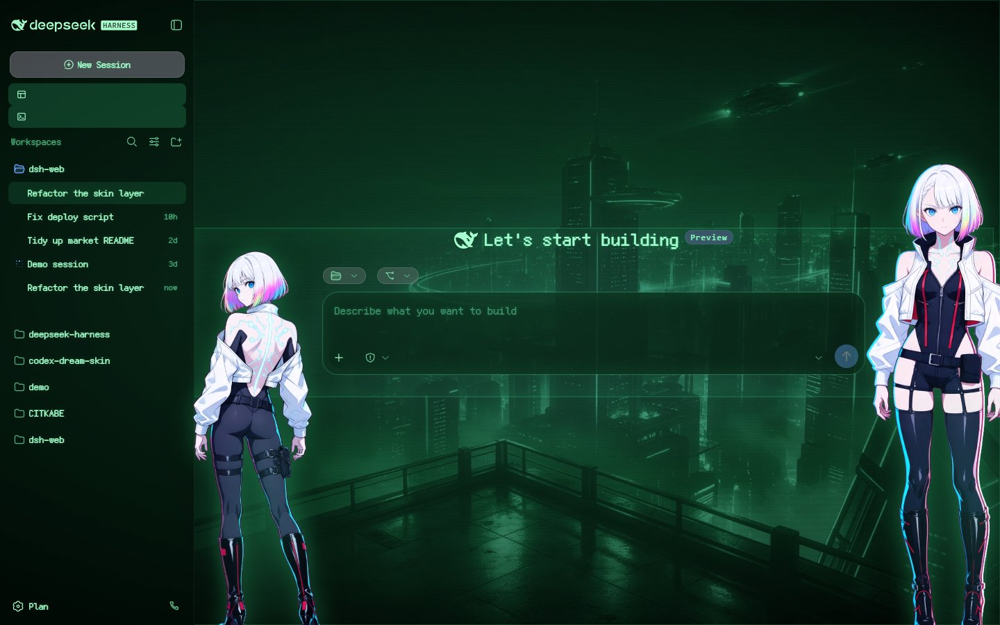

# 磷光 CRT

[English](README.md) | 中文

dsh web GUI 的 CRT 皮肤：暗玻璃上的磷光绿、覆盖中英文的点阵字体、烘焙进素材的扫描线与暗角，两个网络行者立绘钉在输入框左右两沿。

| | |
| --- | --- |
| id | `crt-phosphor` |
| 版本 | 0.1.0 |
| 清单 | v2 |
| 字体 | Fusion Pixel 12px 等宽（OFL-1.1，随包） |
| 许可 | CC BY-NC-SA 4.0（非官方同人） |

## 预览

亮色：

暗色：

两张都是 1440x900 JPEG q85，出自官方 facade 渲染器。

## 是什么

- `skin.css` 重映射官方 token：所有文字与描边变磷光绿、所有面板变近黑绿玻璃，31 个 `--dsw-font-*-font-family` 全部指向随包点阵字体；字体用**本地相对路径**的 `@font-face` 声明（本地相对 URL 能过安全管线，远程的不行）。
- `patches.css` 画管子：`#root::before` 暗角 + 缓慢呼吸，`#root::after` 淡辉光 + 偶发闪烁，正文磷光泛光 + 一丝色差边缘，两个立绘在 `body::before/::after`。
- 扫描线**刻意烘焙进素材**：用 CSS 画 3px 周期的线会和设备像素比打架，看起来就是几条粗带在扫。
- **没有 `hooks.mjs`**：市场预览渲染器不执行皮肤 hooks，所以管子刻意做成纯声明式。

## 交互

投稿的这套皮肤是**纯声明式**的：不带 `hooks.mjs`，因为皮肤契约把 `facets.client`
保留给内置皮肤。可选的可交互版本（点左侧立绘，她会把鲸鱼挂件管线里的余额/用量数字
念出来；右键打开那个挂件的菜单）与相关工具放在独立仓库
`lemonhall/dsh-lucy-companion`。

## 立绘

锚定 `[data-composer-card]`（左立绘用 `left: anchor(--crt-composer left)` 配 `translate: -100% 0`），因此侧栏与 details 栏开合都会跟着走，全程不需要测量；层级 `z-index: 900` —— 高于官方那几层（15~40）、低于鲸鱼娘挂件的 `9999`。

`--crt-portrait-filter` 是唯一旋钮：自然色 + 磷光轮廓，或纯绿幽灵双色调，一行切换。

## 来源与版权

**素材均为 AI 生成。** `assets/` 下的所有位图都由图像模型经 OFOX 图像 API
（`volcengine/doubao-seedream-5.0-pro`）生成，随后在本地处理：场景做磷光双色调与 halation，再烘焙扫描线、暗角与颗粒；立绘做色度键抠图（键色估计、alpha 斜坡、解混、去溢色、alpha 阈值、连通域去噪）。
**没有**向任何模型提交过照片、cosplay 图或其它第三方图片 —— 角色形象是纯文本描述的。

**角色与所属作品。** 两张立绘描绘的是**《赛博朋克：边缘行者》**
（Cyberpunk: Edgerunners）中的 **Lucy / Lucyna Kushinada**。角色设计、作品本身
与世界观的权利归其权利人：**Studio TRIGGER** 与 **CD PROJEKT RED**（及其各自的
许可方与权利继承人）。

**使用条款。** **仅供个人非商业使用。** 本作品为**非官方同人作品**：与
Studio TRIGGER、CD PROJEKT RED、本仓库维护者以及 DeepSeek Harness 项目**均无关联**，
未获其授权、赞助或背书；角色与作品的一切权利归原权利人。若权利人提出异议，
应移除本皮肤。

**皮肤自身的许可。** 皮肤自己的代码与样式（`skin.json`、`skin.css`、`patches.css`，
以及存在时的 `hooks.mjs`）按 **CC BY-NC-SA 4.0** 发布（见仓库 `LICENSE`）。
该许可仅覆盖本项目原创的部分，**不授予**角色或原作品的任何权利。

**与同仓另一套皮肤同源。** 本皮肤使用的是同仓库 `lucy-nightsignal`
皮肤的**同一批抠图立绘** —— 同一提交人、同一次投稿、同一套生成与抠图流程 ——
因此两套皮肤的来源声明完全一致。

**背景与字体。** 两张场景是本项目自有的 AI 生成夜景，经本地处理成磷光双色调。
随包字体为 **Fusion Pixel Font**（OFL-1.1），许可原文在
`assets/FUSION-PIXEL-OFL.txt`，上游三方许可在 `assets/licenses/`；字体保留其自身
许可，独立于本皮肤。

## 已知限制

- 纯呈现层：只改浏览器样式，不触及模型请求。
- 字体按 12px 网格设计，界面里的奇数号（11、13、14、16）会被轻微插值。
- `patches.css` 有几处匹配 CSS-Modules 哈希类名，官方重建后可能改名（`dsh-skin validate` 会按设计 warning）。
- 字体占皮肤总体积（约 1.3 MB）里的 903 KB；子集化能砍掉约一半，代价是生僻字。

完整推导见项目仓库的 `docs/CRT-TECHNIQUE.md`。
