# DeepSeek-Meridian

A DeepSeek male-character skin: switch between outfit styles, and switch to
Claude or GPT palettes. One skin, a whole wardrobe — a single install gives you
the outfit and palette switcher in the lower left of the sidebar, and the choice
is remembered locally.

| 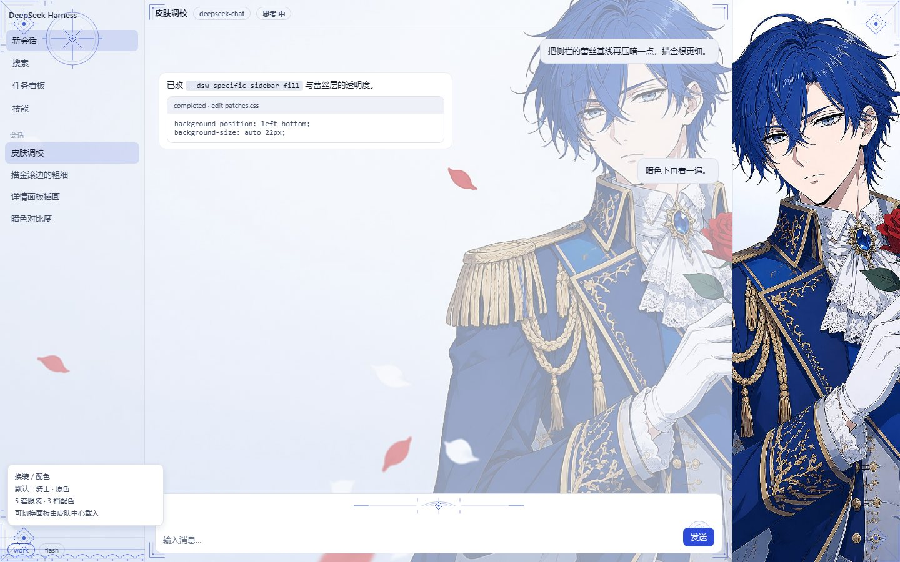 | 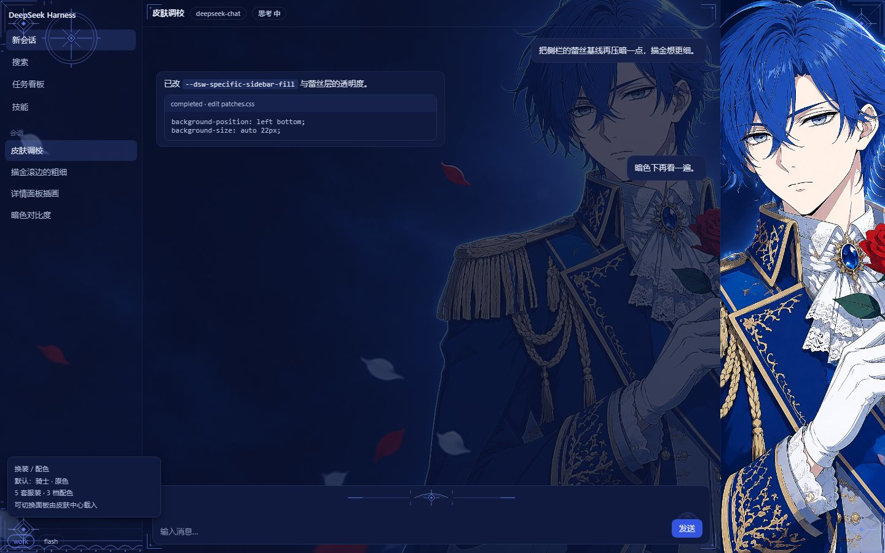 |
|---|---|
| light | dark |

## Outfits (light)

| knight | suit | midsummer | patissier | physician |
|---|---|---|---|---|
| 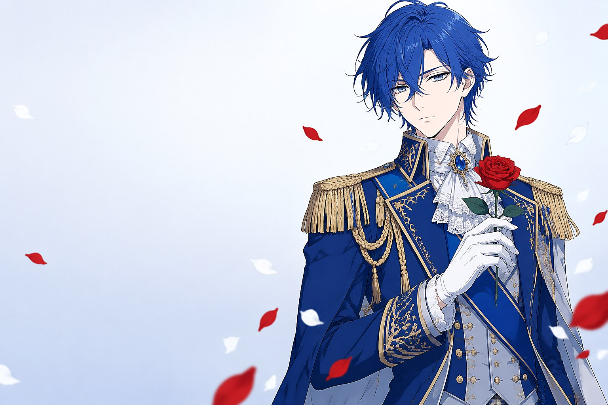 | 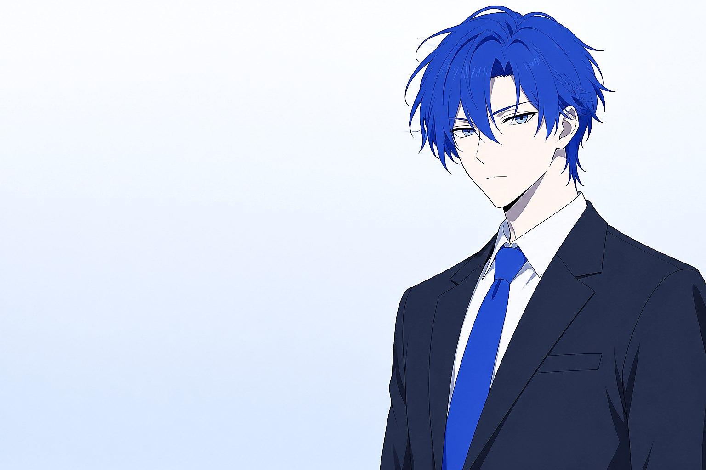 | 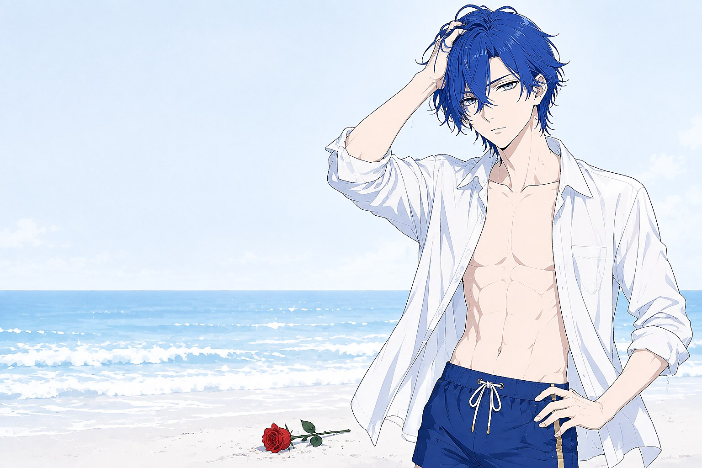 | 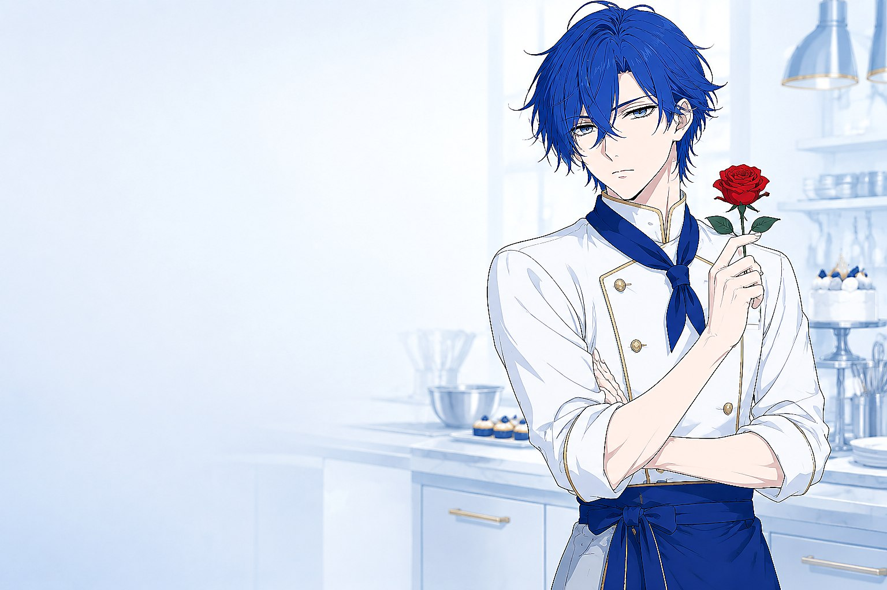 |  |

## Outfits (dark)

| knight | suit | midsummer | patissier | physician |
|---|---|---|---|---|
| 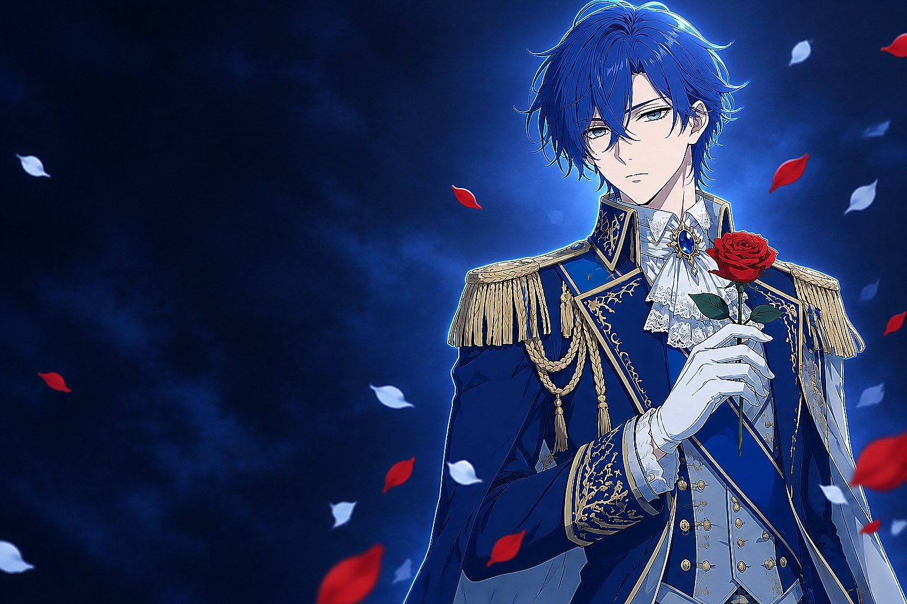 | 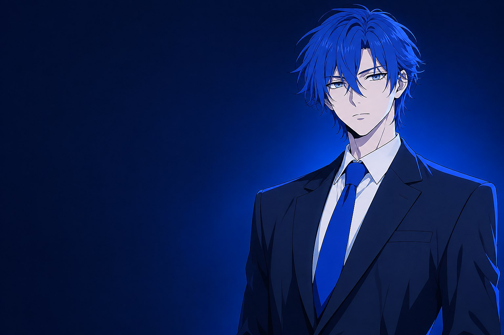 | 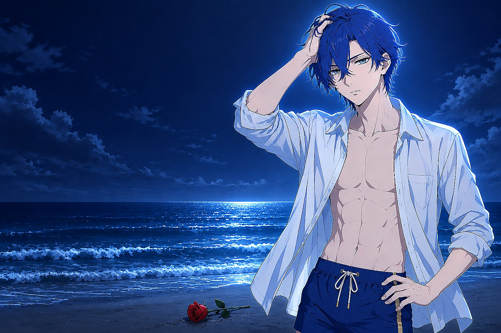 | 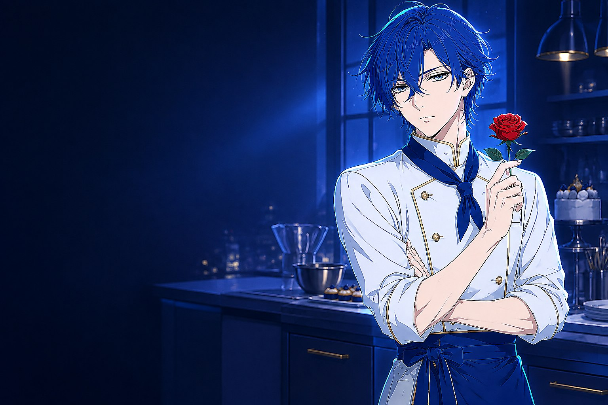 | 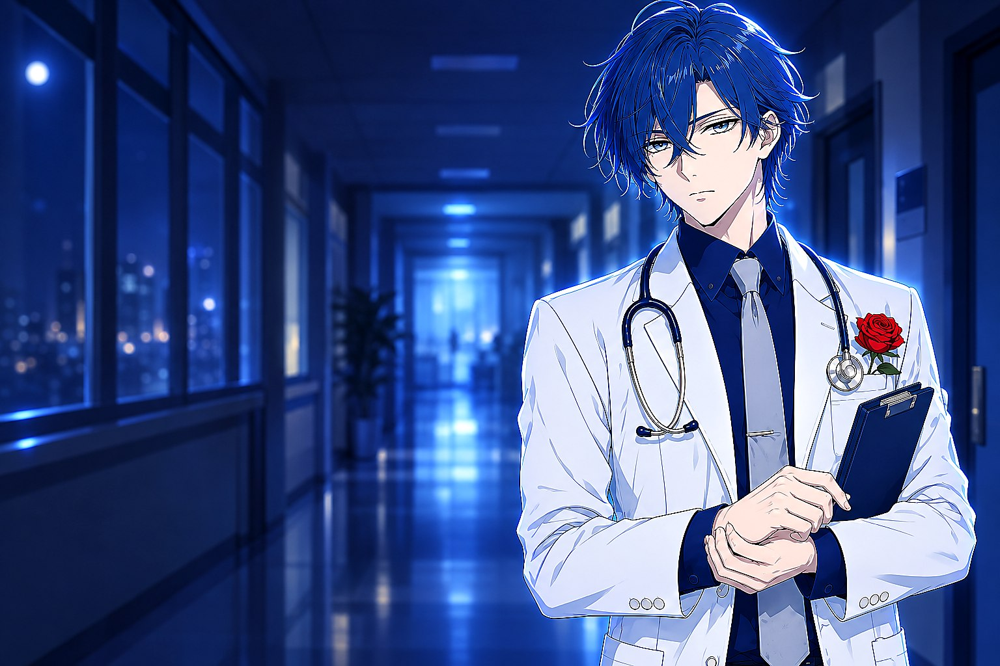 |

## Palettes (light)

| stock | ClauMeridian | GPMeridian |
|---|---|---|
|  | 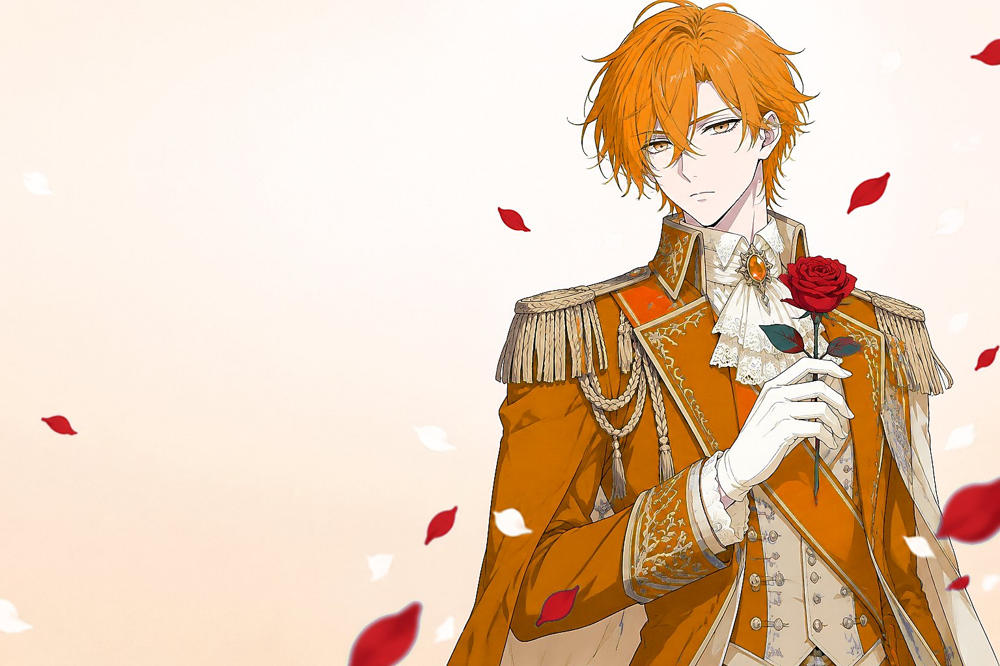 | 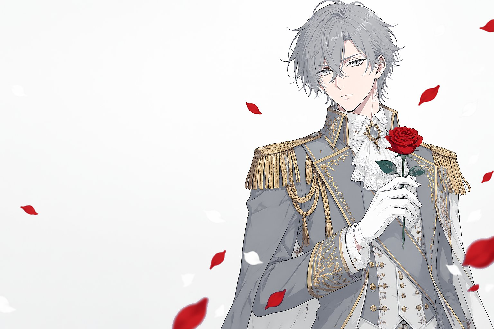 |

## The wardrobe panel

Rendered by `hooks.mjs`, styled declaratively in `patches.css` (which goes
through the CSS safety pipeline and is force-scoped like everything else).

- **Outfits (5)**: knight (default), suit, midsummer, patissier, physician
- **Palettes (3)**: stock, ClauMeridian (warm amber), GPMeridian (silver grey)

Each recolour palette ships its **own hero artwork**, so a palette change is a
re-rendered illustration rather than a filter over one. That is also why the
palettes are hero-only: picking a palette selects the knight, and picking any
other outfit returns to the stock palette.

## How the switch works

- **Outfits**: `hooks.mjs` rewrites the `src` of the host's background ``,
  which the host appends, with its scrim, into the shared decoration layer
  before the hooks run. Nothing else about the background is touched, so the
  host keeps its scrim, opacity, blur and wallpaper-priority behaviour. The
  details portrait follows `body[data-mw-art]` in CSS.
- **Palettes**: `skin.css` overrides the whole `--dsw-*` token set under
  `body[data-mw-palette]`, separately for light and dark.

No host API is involved: outfits and palettes are in-skin state, so this works on
any install where the hooks facet is served.

## Availability of hooks

`hooks.mjs` is the trusted escape hatch of the v2 contract, and the host serves
it only for built-in skins and for market-installed skins (whose installer writes
`dsh-market.provenance.json`). A directory hand-dropped into `~/.dsh/skins/`
gets no provenance, so the panel is not served; the skin then renders its default
knight look with a static note instead.

## Licence and attribution

- Licence: CC BY-NC-SA 4.0
- Artwork: original AI-generated illustrations made for this skin; the original
  reference image is not redistributed
- DeepSeek-Meridian is an unofficial, non-commercial community character concept,
  not affiliated with, endorsed by or sponsored by DeepSeek
